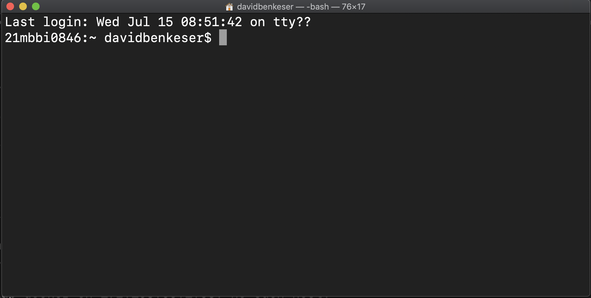

```{r xaringan-themer, include=FALSE, warning=FALSE}
library(xaringanthemer)
# define a class for a block of text with mono spaced print
extra_css <- list(
  ".monobox" = list(
    display = "inline-block", 
    width = "90%",
    height = "400px",
    padding = "5px",
    border = "1px solid #012169",
    `background-color` = "#d9d9d6",
    `font-family` = "Courier Prime",
    `align-items` = "left",
    `vertical-align` = "middle"
  ),
  ".small" =  list(`font-size` = "80%"),
  ".large" =  list(`font-size` = "150%"),
  "ul li" = list(`margin-bottom` = "10px"),
  ".red" = list(color = "#da291c",
                `font-weight` = "600"),
  "a" = list(color = "#007dba"),
  "a:hover" = list("text-decoration" = "underline")
)

style_mono_accent(
  base_color = "#012169",
  header_font_google = google_font("DM Sans"),
  text_font_google   = google_font("DM Sans", "400", "400i"),
  code_font_google   = google_font("Courier Prime"),
  extra_css = extra_css
)
```
<style type="text/css">
.remark-slide-content {
    font-size: 22px
}
</style>

## Learning objectives

1. Contrast graphical user interfaces and command line interfaces as it relates to reproducible research.
2. Identify basic commands to navigate the command line as a file viewer.
3. Describe basic usage of tab completion when navigating the command line.
4. Describe the difference between absolute and relative paths.
4. Identify the correct approach to running `R` code from the command line.

---

## Learning objectives: redux

1. Identify system settings that are needed (e.g., properly setting `PATH`) to run `R` at the command line.
2. Use bash to create, copy, and remove files using both absolute and relative paths.
3. Understand the general construction of bash commands and how to navigate documentation to find help.

---

## Some terminology

__Shell__
* user interface for interacting with a computer
* the "outermost" layer of the operating system
* prompts users for input, interprets input, and handles output from the operating system

__Graphical user interface__ (GUI)
* visual interface (icons, menus, etc...) for interacting with computer
* Don't touch that mouse!

__Command line interface__ (CLI)
* text-based interface for interacting with computer
* Shell languages: `bash`, `sh`, `tcsh`, `zsh`, ...

???

I am not a computer scientist, so I may say
something stupid here. Please correct me if you know better!

GUIs are pretty and user-friendly because anyone who can read and operate a mouse can interact with them, even with very little about computers. However, they are antithetical to our endeavor for reproducible research.

We will instead rely on the CLI to run all our programs. We will focus on 
`bash`, mostly because it's all that I know. People also seem to like `zsh`. 

---

## Some terminology

__Shell script__
* plain text file designed to be run by the shell

__Terminal__
* "terminal emulator"
* a program that lets you interact with the shell

__Important principle:__ Everything scripted!

???

Scripts are the ultimate "paper trail". We can scrutinize the script to see exactly what the computer was told to do. We are working toward scripting all aspects of data cleaning, analysis, and report generation. 

---

## Terminal

If Windows, you can:
* download `git`, which includes `git bash` and a terminal application
  * be sure to set RStudio terminal to `git bash`
* download Windows Subsystem for Linux (WSL2)
  * probably overkill for most users

<div>

If Mac, use [Terminal](https://support.apple.com/guide/terminal/open-or-quit-terminal-apd5265185d-f365-44cb-8b09-71a064a42125/mac)
* Or [iTerm2](https://www.iterm2.com/features.html) -- more features

<div>

If Linux, whatever terminal emulator comes with your distribution. 

???

`git` is a full blown program (application) that runs on Unix-like operating systems (this includes Mac OsX and Linux distributions). `git bash` is not full blown `bash`, but it provides a very similar set of tools. If, for whatever reason, full blown `bash` is desirable, download WSL.

I use Terminal, but should probably switch to iTerm2. 

---

## Terminal

.center[]

???

The terminal is the way we interact with the shell by issuing text-based commands.

We'll be working with bash. If for some reason bash is not the default shell (and you want it to be) this can be changed in Terminal settings.

---

## Moving around directories

By default, the terminal emulator will act like a file viewer.

| __Command__   | __Action__                   |
|:-------------:|------------------------------|
| `pwd`         | print working directory      |
| `cd`          | change directory             |
| `ls`          | list files in directory      |
| `~`           | shortcut for home directory  |


???

The symbol `~` points to your designated home directory on your system.

---

class: title-slide, center, inverse, middle
background-color: #487f84

.large[
`r fontawesome::fa("desktop", fill = "#ffffff")` .white[Finding files]
]

.large[
`r fontawesome::fa("code", fill = "#ffffff")` <a href="finding_files.zip" style="color:#ffffff" download>Code</a>
]

---

## Adding/removing files

Use these commands to make, rename, remove files.

| __Command__     | __Action__                   |
|:---------------:|------------------------------|
| `mkdir`         | make a new directory         |
| `rm`            | delete a file or directory   |
| `mv`            | move a file or directory     |
| `cp`            | copy a file or directory     |
| `touch`         | make an empty file           |

???

`touch` used on an existing file will modify the "last accessed" attribute of that file.

Use `rm -rf` to get delete folders

---

class: title-slide, center, inverse, middle
background-color: #487f84

.large[
`r fontawesome::fa("desktop", fill = "#ffffff")` .white[Manipulating files]
]

.large[
`r fontawesome::fa("desktop", fill = "#ffffff")` <a href="finding_files.zip" style="color:#ffffff" download>Code</a>
]

---

## Previewing contents of files

There are two easy ways to view contents of files without opening the files themselves.

`cat [filename]`
* prints all the contents of file to terminal

`less [filename]`
* browse file line-by-line using arrows and/or page up/down
* press `q` on keyboard to close preview

---

class: title-slide, center, inverse, middle
background-color: #487f84

.large[
`r fontawesome::fa("desktop", fill = "#ffffff")` .white[Previewing files]
]

.large[
`r fontawesome::fa("desktop", fill = "#ffffff")` <a href="finding_files.zip" style="color:#ffffff" download>Code</a>
]

???

Demo: `less code/02_example.R` vs. `cat code/02_example.R`

---

## Moving around directories

.pull-left[.center[
.large[__Absolute paths__]
* .left[`/c/Users/davidbenkeser` (git bash)]
* .left[`/Users/davidbenkeser` (MacOSX)]
* .left[`~/Documents` (both)]
* .left[`/` (both, but different)]
]]

.pull-right[.center[
.large[__Relative paths__]
* .left[`Documents`]
* .left[`./Documents`]
* .left[`../Documents`]
* .left[`../../`]
]]

???

Relative paths are **relative** to the current working directory.

Absolute paths point to an **absolute** location of a file.

The `./` means "in the current directory". The `../` means "in one directory up from the current directory". The `../../` means "in two directories up
from current directory". 

When we get to project management, we will prefer relative paths. It makes sharing code easier -- between different users or, with yourself, on a different computer (e.g., your laptop vs. AWS). The two file systems are probably (definitely) structured differently, but if they share a  project folder with the same relative structure, then code with relative paths should still work.

---

class: title-slide, center, inverse, middle
background-color: #487f84

.large[
`r fontawesome::fa("desktop", fill = "#ffffff")` .white[Absolute vs. relative path]
]

.large[
`r fontawesome::fa("desktop", fill = "#ffffff")` <a href="finding_files.zip" style="color:#ffffff" download>Code</a>
]

???

Demo: from `finding_files` directory, `cat code/00_example.R` in a few different ways: 
1. using relative path from `finding_files` 
2. using absolute path from root directory 
3. using absolute path from home directory
4. using relative path from `../finding_files`

---


## Commands structure

.center[`command [-option(s)] [argument(s)]`]

* `option(s)` are preceded with a `-` or `--`
  * `-` options are a single letter
  * `--` options are longer, informatively named, but can differ in across distributions/shells (I think)

* `argument(s)` tell the command what to operate on
  * `rm` what? `cp` what?

To see available options check `man command`.

Example: `ls -l`

???

The `man`'s for the various commands are sometimes not as helpful
as just googling, "How do I ... `command` bash".

You can string together multiple `-` options, e.g., `ls -la` executes
as `ls -l -a`.

---

## Solving command line problems

Shell languages like `bash` feel weird.
* Very different than e.g., `R` or SAS programming.

How to get help?
* `man [command]` (bash)
* `[command] -help` (git bash)
* Google (with `site:stackoverflow.com`?)
* .red[Try stuff!]

???

I find manuals for Unix commands are often cryptic and not always helpful. Reading them on occasion is still useful. 

Learning to code is a lot like a learning a language. It can be very frustrating that you know *what* you want to say, but you don't know *how* to say it (or you know how, but in another language!). You only get better at language by forcing yourself to use it.

Don't be satisfied with just copy/pasting an answer from StackOverflow. Try (for at least a couple minutes) to understand how it works. This is a worthwhile investment.

---

## Try it at home

Using `bash` help files/the internet figure out how to...

1. from the `code` directory, list all files stored in `code` with sizes displayed in bytes/kilobyes/megabytes

2. from `finding_files directory`, list all files stored in `code` with sizes displayed in bytes/kilobyes/megabytes

3. remove the `data` directory and all its contents

4. rename `00_example.R` to `03_example.R`

Press "p" to see solutions.

???

__Solutions__:
1. Use `cd` to navigate to the `code` directory. Then run `ls -lh`
2. Use `cd` to navigate to the `finding_files` directory. Then run `ls -lh code`
3. From the `finding_files` directory run `rm -rf data`
4. From the `code` directory run `mv 00_example.R 03_example.R`

---

## Wild cards

Wild cards are helpful for searching through files.

| __Command__     | __Action__                              |
|:---------------:|-----------------------------------------|
| `*`             | match anything                          |
| `?`, `??`, ...  | match a single character                |
| `[...]`         | match a range of characters             |

---

class: title-slide, center, inverse, middle
background-color: #487f84

.large[
`r fontawesome::fa("desktop", fill = "#ffffff")` .white[Wildcards]
]

.large[
`r fontawesome::fa("desktop", fill = "#ffffff")` <a href="finding_files.zip" style="color:#ffffff" download>Code</a>
]

???

Demo: 
1. `ls code/*.R` = all `.R` files in `code`
2. `ls code/0[0-2]_example.R`
3. `ls code/0?_example.R`
4. `ls code/0?_*.R`

---

## Quality of life keys

| __Key stroke__         | __Action__                              |
|:----------------------:|-----------------------------------------|
| <code> &#8593;</code>  | move to previous command                |
| <code> &#8595;</code>  | move to next command                    |
| `tab`                  | autocomplete command or file            |
| `ctrl+c`               | cancel (running) command                |
| `ctrl+z`               | suspend command                         |
| `ctrl+r`               | search for command in history           |
| `ctrl+l`               | clear the screen                        |

???

If you take nothing else from this page, remember to use `tab`!

---

class: title-slide, center, inverse, middle
background-color: #487f84

.large[
`r fontawesome::fa("desktop", fill = "#ffffff")` .white[Quality of life]
]

.large[
`r fontawesome::fa("desktop", fill = "#ffffff")` <a href="finding_files.zip" style="color:#ffffff" download>Code</a>
]

???

Demo of tab completion
1. From `finding_files`, type `cd c` and press tab
2. From `finding_files`, type `cd d` and press tab
3. From `code`, type `0` and press tab. What happens?
4. Press tab again to list possible files

Demo of up and down arrows
1. Press up and down arrows to scroll through commands you just executed.

Demo of `ctrl + c`
1. Type `sleep 3` to demonstrate `sleep` command
2. Type `sleep 100` and then hit `ctrl + c` to kill the command

---

## Try it at home

`bash` and shell scripting could be an entire course by themselves.

See [additional readings](https://benkeser.github.io/intro_repro_workflo/readings#command-line) for more resources.

---

## Running code from command line

In this short course, we will primarily use the command line to run `R` code.

The command to do this is:
.center[`Rscript [path to .R file]`.]

To run code directly in `R` from the command line, add `-e` option to `R` or `Rscript command`

On Windows, the directory where `R.exe` and `Rscript.exe` were installed should be [added to your PATH](https://www.architectryan.com/2018/03/17/add-to-the-path-on-windows-10/).

---

class: title-slide, center, inverse, middle
background-color: #487f84

.large[
`r fontawesome::fa("desktop", fill = "#ffffff")` .white[Running R scripts]
]

.large[
`r fontawesome::fa("desktop", fill = "#ffffff")` <a href="finding_files.zip" style="color:#ffffff" download>Code</a>
]

???

Demo:
1. run `Rscript code/00_example.R`
2. run `cd code && Rscript 00_example.R`
3. run `R -e print("hello world")`
4. run `Rscript -e print("hello world")`

