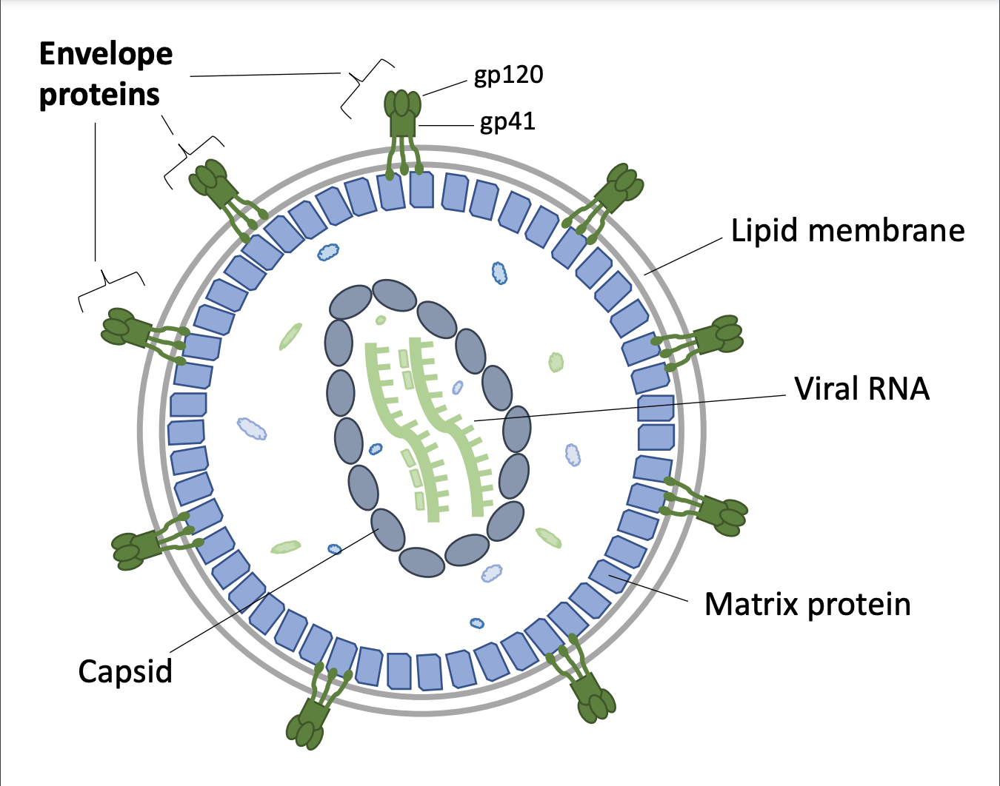

```{r xaringan-themer, include=FALSE, warning=FALSE}
library(xaringanthemer)

extra_css <- list(
  ".clearbox" = list(
    display = "inline-block", 
    width = "100%",
    padding = "5px",
    border = "1px solid #012169",
    `background-color` = "#d9d9d6",
    `align-items` = "left",
    `vertical-align` = "middle"
  ),
  ".small" =  list(`font-size` = "80%"),
  ".large" =  list(`font-size` = "150%"),
  "ul li" = list(`margin-bottom` = "10px"),
  ".red" = list(color = "#da291c",
                `font-weight` = "600"),
  ".green" = list(color = "#348338",
                `font-weight` = "600"),
  ".remark-code-line-highlighted" = list(border = "2px solid #f2a900",
                                         `background-color` = "#002451"),
  ".code-box" = list(display = "inline-block", 
    width = "95%",
    `line-height` = "0.5em",
    padding = "5px",
    `font-size` = "80%",
    `background-color` = "#f6f6f6",
    `align-items` = "left",
    `font-family` = "Courier Prime",
    border = "1px solid black"),
  "a" = list(color = "#007dba"),
  "a:hover" = list("text-decoration" = "underline")
)

style_mono_accent(
  base_color = "#012169",
  header_font_google = google_font("DM Sans"),
  text_font_google   = google_font("DM Sans", "400", "400i"),
  code_font_google   = google_font("Courier Prime"),
  extra_css = extra_css
)
```

<style type="text/css">
.remark-slide-content {
    font-size: 22px
}
</style>

### Background: HIV

```{r, fig.align  = 'center', out.width = "600px", echo = FALSE}

```

---

### Background: Antibody binding

[Stewart-Jones et al. (2016)](https://doi.org/10.1016/j.cell.2016.04.010) showed VRC01 antibody may bind with a glycan shield on Env.
* Some sugars are sticky!

```{r, fig.align  = 'center', out.width = "500px", echo = FALSE}

```

---

### Background: CATNAP data

The [CATNAP database](https://www.ncbi.nlm.nih.gov/pmc/articles/PMC4489231/) contains measurements of HIV resistance to various antibodies.

```{r, echo = FALSE, message = FALSE}
here::i_am("rmarkdown.Rmd")
data_file <- here::here("hiv_project", "data", "vrc01_data.csv")
data <- read.csv(data_file, header = TRUE)
knitr::kable(head(data, 5), row.names = FALSE, digits = 3)
```

* `ab_resistance` = how well Env resists antibody
* `shield_glycans` = number of sugars in shield
* `region` = where virus found
* `env_length` = total amino acids in Env protein

???

Each row is a distinct virus with a different genetic sequence for the envelope protein.

Here we report just a few characteristics

Sugars are really "potential N-linked glycosylation sites".

---

### Motivation: reproducibility

The goal is to generate a report that:
* includes basic descriptive information about the data set
* includes analysis of `ab_resistance ~ shield_glycans`

Reasons to consider reproducibility:
* publication may require code/data submission
* may need to update reports if more data are reported in CATNAP
* may need to use similar analysis for different antibodies
* ...

---

### R Markdown

__What is R Markdown?__
* `R` package developed by [RStudio](https://rstudio.com/).
* blends `R` code chunks, and plain text to generate output

__Why R Markdown__?
* Reproducible reports
* Human readable source code
* Variety of output formats
* No more .red[copy and paste] for results. 

__How do I R Markdown__?
* install `R` + `install.packages('rmarkdown')`
* also need to have [`pandoc` installed](https://pandoc.org/installing.html) (and in `PATH`)

???

If your job involves a heavy amount of data analysis, you will end up creating hundreds if not thousands of reports in your career. Invest the time now to come up with an efficient system for doing this!

Reports made with `rmarkdown` can, in theory, be reproduced by anyone, anywhere.
* caveat is you need: same R version, packages, not to use absolute paths, etc..

---

### Anatomy of an R Markdown document

R Markdown documents consist of three components:

1\. `yaml` header
* specifies meta options for the document
* E.g., title, authors, output format, etc...

2\. Plain text written in markdown
* plain writing + section headers + tables + ...

3\. `R` code
* Inline with writing using single tick  
* Whole "chunk" of code using three ticks

---

### Notes on code demonstrations

Throughout this lecture, we will gradually build up several __R Markdown documents__.

On each code demonstration slide, code is linked.
* (roughly) what the R Markdown document should look like *at the end* of the demonstration.

All of these reports can be [browsed on GitHub](https://github.com/benkeser/intro_repro_workflo/lectures/04_rmarkdown/hiv_report/tmp_reports).

---

class: title-slide, center, inverse, middle
background-color: #487f84

.large[
`r fontawesome::fa("desktop", fill = "#ffffff")` .white[First look at R Markdown]
]

.large[
`r fontawesome::fa("code", fill = "#ffffff")` <a href="https://raw.githubusercontent.com/benkeser/intro_repro_workflo/main/lectures/04_rmarkdown/hiv_project/tmp_reports/01_example_report.Rmd" style="color:#ffffff">Code: `01_example_report.Rmd`</a>
]

???

Demo: 
* type out the contents of `tmp_reports/01_example_report.Rmd`

---

## Rendering

For this moment, we are focused on R Markdown itself, so we will render "the easy way".
* Click "Knit" in R Studio
* Soon, we will be rendering documents from the __command line__.

You can render to different formats via the dropdown menu.
* Or change the `output` option in the `yaml` header
* To render as `.pdf`, must have `LaTeX` installed.

To install LaTeX via `R`: 
* `install.packages("tinytex")`
* `tinytex::install_tinytex()`

---

class: title-slide, center, inverse, middle
background-color: #487f84

.large[
`r fontawesome::fa("desktop", fill = "#ffffff")` .white[First rendered document]
]

.large[
`r fontawesome::fa("code", fill = "#ffffff")` <a href="https://raw.githubusercontent.com/benkeser/intro_repro_workflo/main/lectures/04_rmarkdown/hiv_project/tmp_reports/01_example_report.Rmd" style="color:#ffffff">Code: `01_example_report.Rmd`</a>
]

???

Demo: 
* render as html and review formatting and code, text, and R output
* render as word document via dropdown and review formatting
* render as pdf document by changing yaml and review formatting

---

### Output formats

There are [many output formats](https://rmarkdown.rstudio.com/lesson-9.html#documents). Here are a few useful ones (with links to 
further documentation): 
.small[
| `output`                                                                                       | Description                                                                                                            |
|------------------------------------------------------------------------------------------------|------------------------------------------------------------------------------------------------------------------------|
| [`html_document`](https://bookdown.org/yihui/rmarkdown/html-document.html)                     | html template with many preset themes                                                                                  |
| [`pdf_document`](https://bookdown.org/yihui/rmarkdown/pdf-document.html)                       | pdf using LaTex                                                                                                        |
| [`word_document`](https://bookdown.org/yihui/rmarkdown/word-document.html)                     | MS Word document (can [create custom theme](https://bookdown.org/yihui/rmarkdown-cookbook/word-template.html)) |
| [`ioslides_presentation`](https://bookdown.org/yihui/rmarkdown/ioslides-presentation.html)     | HTML5 presentation slides                                                                                              |
| [`beamer_presentation`](https://bookdown.org/yihui/rmarkdown/beamer-presentation.html)         | pdf presentation slides with beamer                                                                                    |
| [`powerpoint_presentation`](https://bookdown.org/yihui/rmarkdown/powerpoint-presentation.html) | MS Powerpoint presentation                                                                                             |
]

---

### yaml header

R Markdown documents begin with a __yaml header__. 
* "meta-data" for the document
* options that control __how the document is rendered__

Options can be nested. 
* don't forget your `:`'s!
* two spaces, __no tabs__!

Options can include inline `R` code.

???

I am constantly messing up yaml syntax and chasing down mysterious errors. Once you have a header you like, I recommend sticking with it unless you have serious cause to change it. 

There are almost endless options for customizing the looks of documents.
* Some are native to the type of document being rendered (e.g., LaTex-specific options)

---

class: title-slide, center, inverse, middle
background-color: #487f84

.large[
`r fontawesome::fa("desktop", fill = "#ffffff")` .white[Updating the yaml header]
]

.large[
`r fontawesome::fa("code", fill = "#ffffff")` <a href="https://raw.githubusercontent.com/benkeser/intro_repro_workflo/main/lectures/04_rmarkdown/hiv_project/tmp_reports/02_example_report.Rmd" style="color:#ffffff">Code: `02_example_report.Rmd`</a>
]

???

Demo: 
* 02_example_report.Rmd
* update yaml header to include inline date
* update yaml header to include a toc and change code highlighting

---

### Markdown

Use Markdown to format the text and write-up of your analysis.
* See [Markdown cheatsheet](https://www.markdownguide.org/cheat-sheet/) for options

You can also intersperse LaTeX and/or html.

---

class: title-slide, center, inverse, middle
background-color: #487f84

.large[
`r fontawesome::fa("desktop", fill = "#ffffff")` .white[Mixing in LaTeX and html]
]

.large[
`r fontawesome::fa("code", fill = "#ffffff")` <a href="https://raw.githubusercontent.com/benkeser/intro_repro_workflo/main/lectures/04_rmarkdown/hiv_project/tmp_reports/03_example_report.Rmd" style="color:#ffffff">Code: `03_example_report.Rmd`</a>
]

???

Demo: 
* See `03_example_report.Rmd`
* Add `<ol>` tag for list in html and render html
* Add `itemize` for list in LaTeX and render pdf

---

### knitr and pandoc

* [`rmarkdown`](https://rmarkdown.rstudio.com/)
  * user-friendly wrapper around `knitr` and `pandoc`

* [`knitr`](https://yihui.org/knitr/)
  * an `R` package that executes code chunks
  * "knits" results back to document

* [`pandoc`](https://pandoc.org/)
  * a general purpose document converter
  * command line tool, no GUI
  * `brew install pandoc`

???

It's useful to understand which program is doing what in case you need to chase down errors. 

---

### Code chunk options

Each code chunk gets a label.
* avoid spaces, underscores, periods; hyphens are safe

Each chunk has __options__. Options can be included by either:
* comma separated list between 
  * `{r, chunk-label, option1 = foo, option2 = bar }`
* special demarcated comment
  * `{r, chunk-label}`
  * `#| option1 = foo,`
  * `#| option2 = bar`
* or as yaml
  * `{r, chunk-label}`
  * `#| option1: foo`
  * `#| option2: bar`

---

### Code chunk options

Common options for __controlling display__ of results.
* For a full list see 
[here](https://yihui.org/knitr/options/).

| Option    | Action                                              |
|:----------|:----------------------------------------------------|
| `eval`    | Run the code included in the chunk?                 |
| `echo`    | Show the code chunk in the rendered document?       |
| `warning` | Print warning messages generated by code?           |
| `error`   | Print and keep running after errors?                |
| `message` | Print messages generated by code?                   |
| `include` | Show the code and results in the rendered document? |

---

class: title-slide, center, inverse, middle
background-color: #487f84

.large[
`r fontawesome::fa("desktop", fill = "#ffffff")` .white[Demonstrating code chunk options]
]

.large[
`r fontawesome::fa("code", fill = "#ffffff")` <a href="https://raw.githubusercontent.com/benkeser/intro_repro_workflo/main/lectures/04_rmarkdown/hiv_project/tmp_reports/04_example_report.Rmd" style="color:#ffffff">Code: `04_example_report.Rmd`</a>
]

???

Demo: 
* See `04_example_report.Rmd` for exact syntax
* Add `echo` options to code chunks

---

### Tables

There are several options for __making tables in R Markdown__.
* just print a data.frame or matrix
  * .green[\+] easy, .red[-] monospaced format
* [`knitr::kable`](https://bookdown.org/yihui/rmarkdown-cookbook/kable.html)
  * .green[\+] easy, nice looking, .red[-] not 100% flexible
* [`gt`](https://gt.rstudio.com/)
  * .green[\+] tidyverse compatible syntax, highly flexible, .red[-] only html for now
* [`xtable::xtable`](https://www.rdocumentation.org/packages/xtable/versions/1.8-4/topics/xtable)
  * .green[\+] highly customizable, .red[-] only for pdfs (LaTex based)
* [`pander::pander`](https://cran.r-project.org/web/packages/pander/vignettes/knitr.html)
  * .green[\+] default tables for different `R` classes
* [`stargazer::stargazer`](https://cran.r-project.org/web/packages/stargazer/vignettes/stargazer.pdf)

???

I find `kable` sufficient for 90\% of my report needs and `xtable` for creating tables for LaTex manuscripts. `gt` looks like it will soon become industry standard, as all things tidyverse tend to do. 

Think about whether there is a need for really nicely formatted tables or whether raw output is OK. Who's the audience?

---

class: title-slide, center, inverse, middle
background-color: #487f84

.large[
`r fontawesome::fa("desktop", fill = "#ffffff")` .white[Start of Rmd for HIV analysis]
]

.large[
`r fontawesome::fa("code", fill = "#ffffff")` <a href="https://raw.githubusercontent.com/benkeser/intro_repro_workflo/main/lectures/04_rmarkdown/hiv_project/tmp_reports/01_hiv_report.Rmd" style="color:#ffffff">Code: `01_hiv_report.Rmd`</a>
]

???

Demo:
* 01_hiv_report.Rmd
* Add code chunks to read data, label data, and build a table 1

---

### Figures

Figures produced by R code will be placed __after the code chunk__ from which they were generated. 

See all [figure options here](https://yihui.org/knitr/options/#plots)
* Most relevant options are `fig.cap`, and `fig.align`, `out.width`, `out.height`

---

class: title-slide, center, inverse, middle
background-color: #487f84

.large[
`r fontawesome::fa("desktop", fill = "#ffffff")` .white[Add scatter plot to HIV analysis]
]

.large[
`r fontawesome::fa("code", fill = "#ffffff")` <a href="https://raw.githubusercontent.com/benkeser/intro_repro_workflo/main/lectures/04_rmarkdown/hiv_project/tmp_reports/02_hiv_report.Rmd" style="color:#ffffff">Code: `02_hiv_report.Rmd`</a>
]

???

Demo:
* 02_hiv_report.Rmd
* Add code chunk to generate scatterplot
* Change size and alignment using chunk options

---

class: title-slide, center, inverse, middle
background-color: #487f84

.large[
`r fontawesome::fa("desktop", fill = "#ffffff")` .white[Add the main regression analysis]
]

.large[
`r fontawesome::fa("code", fill = "#ffffff")` <a href="https://raw.githubusercontent.com/benkeser/intro_repro_workflo/main/lectures/04_rmarkdown/hiv_project/tmp_reports/03_hiv_report.Rmd" style="color:#ffffff">Code: `03_hiv_report.Rmd`</a>
]

???

Demo:
* `03_hiv_report.Rmd`
* Add section for regression analysis
* Report fits from two models using `gtsummary`

---

### Code chunk options

Change __options for all chunks__ using code chunk at the top of the `.Rmd`.

````markdown
`r ''````{r, setup, include = FALSE, message = FALSE, warning = FALSE}
library(knitr)
opts_chunk$set(
  echo = FALSE, message = FALSE, warning = FALSE
)
```
````

Note that you still need to suppress the code chunk that includes the call to `opts_chunk$set()`.

---

class: title-slide, center, inverse, middle
background-color: #487f84

.large[
`r fontawesome::fa("desktop", fill = "#ffffff")` .white[Setting global chunk options]
]

.large[
`r fontawesome::fa("code", fill = "#ffffff")` <a href="https://raw.githubusercontent.com/benkeser/intro_repro_workflo/main/lectures/04_rmarkdown/hiv_project/tmp_reports/04_hiv_report.Rmd" style="color:#ffffff">Code: `04_hiv_report.Rmd`</a>
]

???

Demo:
* `04_hiv_report.Rmd`
* Add code chunk to suppress all code, messages, warnings.
* Render and compare

---

### Code chunk options

Suppose we would like to use the same Rmd code for two purposes:
* __testing__: display code, messages for debugging purposes
* __production__: suppress code, messages for sharing purposes

Option values can be __any valid `R` expression__.
* Define a `TRUE/FALSE` variable
* If `TRUE`, hide chunks
* If `FALSE`, display all code and messages

---

class: title-slide, center, inverse, middle
background-color: #487f84

.large[
`r fontawesome::fa("desktop", fill = "#ffffff")` .white[Creating a production switch]
]

.large[
`r fontawesome::fa("code", fill = "#ffffff")` <a href="https://raw.githubusercontent.com/benkeser/intro_repro_workflo/main/lectures/04_rmarkdown/hiv_project/tmp_reports/05_hiv_report.Rmd" style="color:#ffffff">Code: `05_hiv_report.Rmd`</a>
]

???

Demo:
* `05_hiv_report.Rmd`
* Add chunk to beginning defining a variable named `production`
* Only evaluate the `opts_set` chunk if not in `production`

---

## Rendering from the command line

We will be rendering documents from the __command line__.

What does clicking "Knit" actually do?
* runs a function called `render` from the `rmarkdown` package

---

## Rendering from the command line

__Option 1__: 

* Make `render_report.R` script in same directory as `hiv_report.Rmd` that contains the following:

```{r, render-r-script, eval = FALSE}
library(rmarkdown)
render('hiv_report.Rmd')
```

* Use `Rscript` to run the code at the command line:

```{bash, eval = FALSE}
Rscript render_report.R
```

---

## Rendering from the command line

__Option 2__: 

* From the directory that contains `hiv_report.Rmd`, run `Rscript` with `-e` option:

```{bash, render-demo, eval = FALSE}
Rscript -e "library(rmarkdown); render('hiv_report.Rmd')"
```

See the [`render` documentation](https://rmarkdown.rstudio.com/docs/reference/render.html) for options. 

???

You could equivalently write this as:

`Rscript -e "rmarkdown::render('hiv_report.Rmd')`

The `::` syntax in the `R` command says, "in the `rmarkdown` package use the (exported, see R packages lecture) function `render`. 

* Allows us to avoid the extra line of code to load the library

---

class: title-slide, center, inverse, middle
background-color: #487f84

.large[
`r fontawesome::fa("desktop", fill = "#ffffff")` .white[Rendering from the command line]
]

.large[
`r fontawesome::fa("code", fill = "#ffffff")` <a href="https://raw.githubusercontent.com/benkeser/intro_repro_workflo/main/lectures/04_rmarkdown/hiv_project/tmp_reports/01_render_report.R" style="color:#ffffff">Code: `01_render_report.R`</a>
]

.large[
and
]

.large[
`r fontawesome::fa("code", fill = "#ffffff")` <a href="https://raw.githubusercontent.com/benkeser/intro_repro_workflo/main/lectures/04_rmarkdown/hiv_project/tmp_reports/05_hiv_report.Rmd" style="color:#ffffff">Code: `05_hiv_report.Rmd`</a>
]

???

Demo:
* `05_hiv_report.Rmd` + `01_render_report.R`
* Show rendering via running R script and with `-e` option.

---

## Parameterized reports

The code chunk defining the `production` variable in `R` is not ideal.
* Manual point/click/type work required

__Parametrized reports__ provide a programmatic way to change this option.

In `yaml`, define `params` option to set defaults.
* `params` object is available in `R` session to check parameter settings when document is rendered.

---

class: title-slide, center, inverse, middle
background-color: #487f84

.large[
`r fontawesome::fa("desktop", fill = "#ffffff")` .white[Parameterizing the report]
]


.large[
`r fontawesome::fa("code", fill = "#ffffff")` <a href="https://raw.githubusercontent.com/benkeser/intro_repro_workflo/main/lectures/04_rmarkdown/hiv_project/tmp_reports/02_render_report.R" style="color:#ffffff">Code: `02_render_report.R`</a>
]

.large[
and
]

.large[
`r fontawesome::fa("code", fill = "#ffffff")` <a href="https://raw.githubusercontent.com/benkeser/intro_repro_workflo/main/lectures/04_rmarkdown/hiv_project/tmp_reports/06_hiv_report.Rmd" style="color:#ffffff">Code: `06_hiv_report.Rmd`</a>
]


???

Demo:
* `06_hiv_report.Rmd` + `02_render_report.R`
* Add `params` option to `yaml` with default to be not production.
* Change code chunk to reference `params$production`
* Add line to `02_render_report.R` to render with different parameters
* Add second parameter `cutpoint`.
* Change model formula for secondary model.
* Add inline `R` expression to indicate cutpoint.
* Add line to `02_render_report.R` to render with a different cutpoint.
